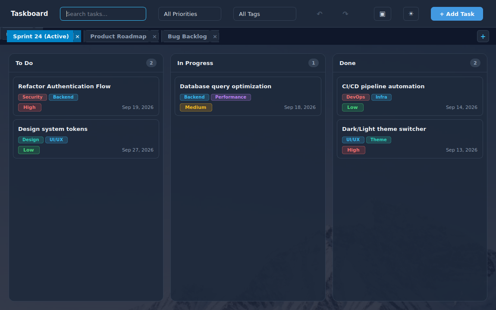
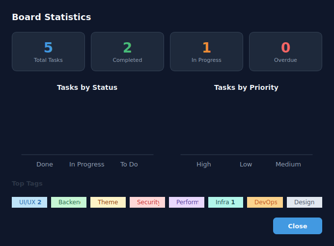

# qt-taskboard

A modern, responsive desktop Kanban task board application built with **C++17** and **Qt 6 (Widgets)**.

Designed with a modern frosted glass and pastel aesthetic, multi-board project management, visual statistics analytics, runtime dark/light theme switching, model/view architecture, comprehensive undo/redo, dynamic filtering, and local JSON persistence.

---

## Previews

### ☀️ Light Mode & Kanban Board


### 🌙 Dark Mode (Runtime Theme Switching)


### 📊 Statistics & Analytics Dashboard (Ctrl+Shift+S)


### 📝 Task Details, Creation & Editing
| Task Details | New / Edit Task Dialog |
| :---: | :---: |
|  |  |

---

## Architectural Design

The project strictly follows a decoupled 3-tier architectural separation to maintain clean boundaries between UI, domain logic, and data storage:

```text
src/
├── core/       # Business domain layer
│   ├── Task.h/.cpp               # Value-type task entity
│   ├── Board.h/.cpp              # Single-board aggregate & signals
│   ├── BoardManager.h/.cpp       # Multi-board collection manager (Tier 3)
│   ├── Command.h/.cpp            # Command pattern actions (Add/Edit/Delete/Move)
│   ├── CommandHistory.h/.cpp     # Undo/Redo stack manager
│   ├── ThemeManager.h/.cpp       # Runtime QSS theme engine (Tier 3)
│   ├── TaskListModel.h/.cpp      # QAbstractListModel implementation (Tier 3)
│   └── TaskSortFilterModel.h/.cpp# QSortFilterProxyModel for filtering/sorting (Tier 3)
│
├── data/       # Persistence abstraction
│   └── JsonStore.h/.cpp          # QJsonDocument serialization (v1 & multi-board v2)
│
└── ui/         # Presentation layer (Qt Widgets)
    ├── MainWindow.h/.cpp         # Main application window & toolbars
    ├── BoardBarWidget.h/.cpp     # Switchable board tab strip (Tier 3)
    ├── BoardColumnWidget.h/.cpp  # Kanban status column container & drop target
    ├── TaskCardWidget.h/.cpp     # Interactive card widget with drag source
    ├── TaskCardDelegate.h/.cpp   # QStyledItemDelegate for Model/View views (Tier 3)
    ├── StatsDialog.h/.cpp        # Statistics dashboard dialog (Tier 3)
    ├── ChartWidget.h/.cpp        # Custom animated QPainter bar chart (Tier 3)
    ├── TaskEditDialog.h/.cpp     # Frameless task creation/editing modal
    └── TaskDetailsDialog.h/.cpp  # Task details view modal
```

### Memory Ownership & Stability Strategy
- **Core Layer:** Strict modern C++ RAII using `std::unique_ptr` for Command objects in `CommandHistory` and value semantics for `Task` models inside `Board`.
- **UI Layer:** Qt parent-child ownership tree (`QObject` parenting) ensures automatic and deterministic cleanup of child widgets and layouts when windows/columns are destroyed.
- **Signal-Decoupled Operations:** Safe asynchronous cleanup (`deleteLater()`, `QTimer::singleShot()`, and `Qt::QueuedConnection`) prevents lifecycle use-after-free conflicts during active drag-and-drop event loops or board deletion.
- **Pre-Destruction Signaling:** `BoardManager::boardAboutToBeRemoved` ensures active listeners disconnect cleanly while objects are still valid in memory.

---

## Feature Checklist & Status

### ✅ Tier 1 — Minimum Core (Completed)
- [x] **Task Data Model:** Full model with Title, Description, Priority (Low, Medium, High), and Due Date.
- [x] **Kanban Board:** Three standard workflow columns (*To Do*, *In Progress*, *Done*) with live task counters.
- [x] **Task Management:** Custom dialogs to create, modify, and delete tasks.
- [x] **Drag & Drop:** Safe, intuitive card dragging between columns with visual drop target feedback.
- [x] **JSON Persistence:** Automatic atomic serialization to standard application data path (`board.json`).
- [x] **Search & Priority Filtering:** Real-time search query filtering and priority-based filtering.

### ✅ Tier 2 — Enhancements (Completed)
- [x] **Colored Tags & Tag Filtering:** Dynamic pastel badge pills on cards with toolbar tag dropdown filter.
- [x] **Task Details Dialog:** Dedicated modal displaying detailed description, tags, and ISO 8601 timestamps (`createdAt`, `modifiedAt`).
- [x] **QSettings Persistence:** Window size, screen position, maximized state, and filter preferences persisted across restarts.
- [x] **Undo / Redo (Command Pattern):** Full history stack supporting `Ctrl+Z` / `Ctrl+Y` and dedicated toolbar buttons for adding, modifying, deleting, and moving tasks.

### ✅ Tier 3 — Advanced Stretch Goals (Completed)
- [x] **11. Multiple Boards:** Switchable project boards with a dedicated tab strip (`BoardBarWidget`). Supports creating (`+`), inline renaming (double-click), and deleting with confirmation. Persisted in Version 2 multi-board JSON format with automatic backward-compatible migration.
- [x] **12. Statistics Dashboard:** Visual analytics modal (`StatsDialog`) featuring custom animated 60 FPS bar charts (`ChartWidget` with `QPainter`), status and priority distributions, tag analytics, and overview summary cards. Shortcut: `Ctrl+Shift+S`.
- [x] **13. Model/View Architecture:** Full `QAbstractListModel` (`TaskListModel`), `QSortFilterProxyModel` (`TaskSortFilterModel`), and custom `QStyledItemDelegate` (`TaskCardDelegate`) for scalable item views.
- [x] **14. Runtime Theme Switcher:** Instant Dark Mode / Light Mode toggle (`ThemeManager`) without restart via toolbar button (🌙 / ☀️). Theme preference is persisted in `QSettings`.

---

## Keyboard Shortcuts

| Shortcut | Action |
| :--- | :--- |
| `Ctrl+Z` | Undo last task action |
| `Ctrl+Y` | Redo last undone action |
| `Ctrl+Shift+S` | Open Board Statistics Dashboard |
| `Escape` | Close active dialog / modal |

---

## Building and Running

### Prerequisites
- **C++ Compiler:** GCC 10+, Clang 11+, or MSVC 2019+ (with C++17 support)
- **CMake:** Version 3.16 or newer
- **Qt 6:** Qt 6.2+ (`qt6-base-dev`)
- **Build tool:** Ninja or GNU Make

### Build Instructions

```bash
# 1. Clone the repository
git clone https://github.com/kirazizi/qt-taskboard.git
cd qt-taskboard

# 2. Configure build with CMake
cmake -B build -G Ninja -DCMAKE_BUILD_TYPE=Release

# 3. Build executable
cmake --build build

# 4. Run application
./build/qt-taskboard
```
