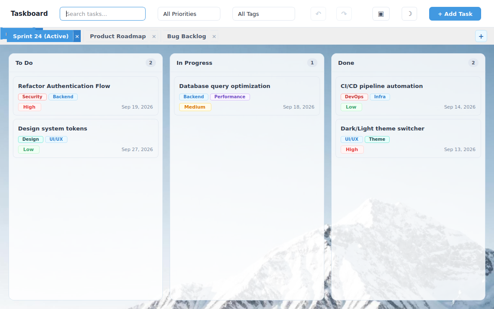
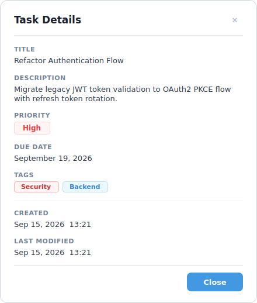
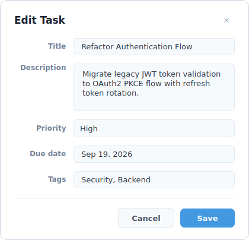

# qt-taskboard

A modern, responsive desktop Kanban task board application built with **C++17** and **Qt 6 (Widgets)**.

Designed with a modern frosted glass and pastel aesthetic, robust layer separation, comprehensive undo/redo, dynamic filtering, and local JSON persistence.

---

## Previews

### Home Page & Kanban Board

### Task Details, Creation & Editing
| Task Details | New / Edit Task Dialog |
| :---: | :---: |
|  |  |

---

## Architectural Design

The project strictly follows a 3-tier architectural separation to maintain clean boundaries between UI, domain logic, and data storage:

`
src/
├── core/       # Business domain layer (Task, Board, Command pattern)
│               # Pure C++ logic, no QWidget dependencies.
│               # Ownership: std::unique_ptr & STL containers.
├── data/       # Persistence abstraction (JsonStore via QJsonDocument).
│               # Handles I/O serialization & deserialization.
└── ui/         # Presentation layer (MainWindow, BoardColumnWidget, TaskCardWidget, Dialogs).
                # Driven strictly by Qt Signals & Slots.
                # Ownership: Qt parent-child QObject tree.
`

### Memory Ownership Strategy
- **Core Layer:** Strict modern C++ RAII using std::unique_ptr for Command objects in CommandHistory and value semantics for Task models inside Board.
- **UI Layer:** Qt parent-child ownership tree (QObject parenting) ensures automatic and deterministic cleanup of child widgets and layouts when windows/columns are destroyed.
- **Signal-Decoupled Operations:** Safe asynchronous cleanup (deleteLater() and Qt::QueuedConnection) prevents lifecycle use-after-free conflicts during active drag-and-drop event loops.

---

## Feature Checklist & Status

###  Tier 1 — Minimum Core (Completed)
- [x] **Task Data Model:** Full model with Title, Description, Priority (Low, Medium, High), and Due Date.
- [x] **Kanban Board:** Three standard workflow columns (*To Do*, *In Progress*, *Done*) with live task counters.
- [x] **Task Management:** Custom dialogs to create, modify, and delete tasks.
- [x] **Drag & Drop:** Safe, intuitive card dragging between columns with visual drop target feedback.
- [x] **JSON Persistence:** Automatic atomic serialization to standard application data path (oard.json).
- [x] **Search & Priority Filtering:** Real-time search query filtering and priority-based filtering.

###  Tier 2 — Enhancements (Completed)
- [x] **Colored Tags & Tag Filtering:** Dynamic pastel badge pills on cards with toolbar tag dropdown filter.
- [x] **Task Details Dialog:** Dedicated modal displaying detailed description, tags, and ISO 8601 timestamps (createdAt, modifiedAt).
- [x] **QSettings Persistence:** Window size, screen position, maximized state, and filter preferences persisted across restarts.
- [x] **Undo / Redo (Command Pattern):** Full history stack supporting Ctrl+Z / Ctrl+Y and dedicated toolbar buttons for adding, modifying, deleting, and moving tasks.

### ⏳ Tier 3 — Advanced Stretch Goals (In Progress / Next)
- [ ] **11. Multiple Boards:** Switchable project boards.
- [ ] **12. Statistics Dashboard:** Visual analytics (Qt Charts or custom QPainter visualization).
- [ ] **13. Model/View Architecture:** Full QAbstractListModel and QSortFilterProxyModel implementation.
- [ ] **14. Runtime Theme Switcher:** Instant Dark / Light theme switching without restarting.

---

## Building and Running

### Prerequisites
- **C++ Compiler:** GCC 10+, Clang 11+, or MSVC 2019+ (with C++17 support)
- **CMake:** Version 3.16 or newer
- **Qt 6:** Qt 6.2+ (qt6-base-dev)
- **Build tool:** Ninja or GNU Make

### Build Instructions

`ash
# 1. Clone the repository
git clone https://github.com/kirazizi/qt-taskboard.git
cd qt-taskboard

# 2. Configure build with CMake
cmake -B build -G Ninja -DCMAKE_BUILD_TYPE=Release

# 3. Build executable
cmake --build build

# 4. Run application
./build/qt-taskboard
`

---

## Known Issues & Limitations
- Running in headless or minimal container environments without a physical display requires QT_QPA_PLATFORM=offscreen or Xvfb for automated headless rendering.
- Drag-and-drop operations rely on Qt's drag mime data; drop positioning currently appends to column targets.
